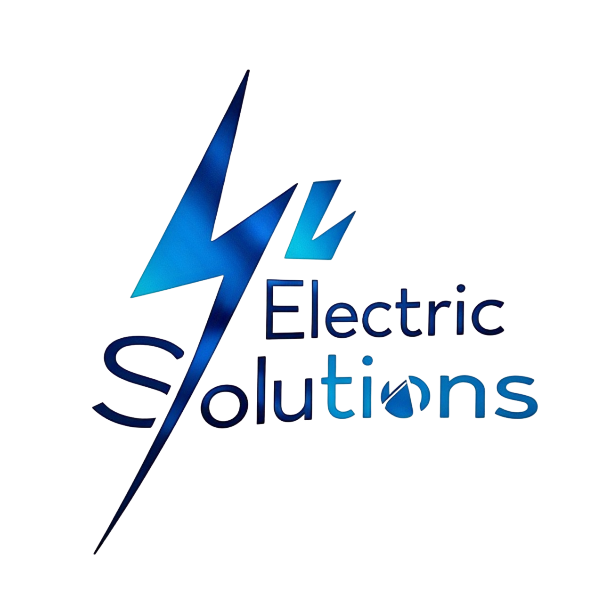

<div align="center">
  
  
  # ⚡ Electric Solutions
  
  ### *Premium Electrical Services & Repair Platform*
  
  [](https://electric-solutions.vercel.app/)
  [](https://github.com/deepak748030/Electric-Solutions.git)
  [](https://reactjs.org/)
  [](https://www.typescriptlang.org/)
  [](https://tailwindcss.com/)

  <p align="center">
    <strong>🔧 Professional electrical services platform connecting customers with certified technicians</strong>
  </p>
  
  ---
  
  <p align="center">
    <a href="#-features">Features</a> •
    <a href="#-demo">Demo</a> •
    <a href="#-installation">Installation</a> •
    <a href="#-tech-stack">Tech Stack</a> •
    <a href="#-project-structure">Structure</a> •
    <a href="#-contributing">Contributing</a> •
    <a href="#-contact">Contact</a>
  </p>
</div>

---

## 🌟 **Project Overview**

Electric Solutions is a modern web application built with React and TypeScript that connects customers with professional electrical service providers. The platform features a comprehensive service booking system, user authentication with OTP verification, and an admin dashboard for service management.

### 🎯 **Mission Statement**
*"Connecting communities with reliable, professional electrical services through innovative technology and exceptional user experience."*

---

## ✨ **Key Features**

<table>
  <tr>
    <td align="center" width="33%">
      <h3>🔐 <strong>Secure Authentication</strong></h3>
      <p>Complete user registration and login system with mobile OTP verification</p>
    </td>
    <td align="center" width="33%">
      <h3>🛠️ <strong>Service Management</strong></h3>
      <p>Comprehensive electrical services catalog with categories and detailed information</p>
    </td>
    <td align="center" width="33%">
      <h3>📱 <strong>Responsive Design</strong></h3>
      <p>Mobile-first design optimized for all devices using Tailwind CSS</p>
    </td>
  </tr>
  <tr>
    <td align="center">
      <h3>👨‍💼 <strong>Admin Dashboard</strong></h3>
      <p>Full admin panel for managing services, orders, categories, and user profiles</p>
    </td>
    <td align="center">
      <h3>📊 <strong>Order Management</strong></h3>
      <p>Complete order tracking and management system for both users and admins</p>
    </td>
    <td align="center">
      <h3>💳 <strong>Payment Integration</strong></h3>
      <p>Razorpay payment gateway integration for secure transactions</p>
    </td>
  </tr>
</table>

### 🚀 **Application Pages & Features**

- **🏠 Homepage**: Hero section with service categories and featured electrical services
- **🔐 Authentication**: Login/Register with mobile OTP verification system
- **🛠️ Services**: Comprehensive electrical services catalog with search and filtering
- **📞 Contact**: Contact form and customer support information
- **ℹ️ About**: Company information and team details
- **📦 User Orders**: Order history and status tracking for customers
- **👨‍💼 Admin Panel**: Complete administrative control including:
  - Dashboard with analytics and statistics
  - Service management (CRUD operations)
  - Category management
  - Order management and tracking
  - User profile management
  - Settings and configuration

---

## 🎬 **Demo**

### 🖥️ **Live Application**
Experience the platform: **[electric-solutions.vercel.app](https://electric-solutions.vercel.app/)**

### 📱 **Key Screenshots**

<div align="center">
  
  
</div>

---

## 🛠️ **Tech Stack**

<div align="center">
  <table>
    <tr>
      <td align="center"><strong>Frontend Framework</strong></td>
      <td align="center"><strong>Styling & UI</strong></td>
      <td align="center"><strong>State & Data</strong></td>
      <td align="center"><strong>Development</strong></td>
    </tr>
    <tr>
      <td align="center">
        
        <br>
        
        <br>
        
      </td>
      <td align="center">
        
        <br>
        
        <br>
        
      </td>
      <td align="center">
        
        <br>
        
        <br>
        
      </td>
      <td align="center">
        
        <br>
        
        <br>
        
      </td>
    </tr>
  </table>
</div>

### 📚 **Core Dependencies**

```json
{
  "frontend": {
    "react": "^18.3.1",
    "react-dom": "^18.3.1",
    "react-router-dom": "^6.26.2",
    "typescript": "latest"
  },
  "ui_components": {
    "@radix-ui/react-*": "latest",
    "tailwindcss": "latest",
    "lucide-react": "^0.462.0",
    "class-variance-authority": "^0.7.1"
  },
  "state_management": {
    "@tanstack/react-query": "^5.56.2",
    "react-hook-form": "^7.53.0",
    "zod": "^3.23.8"
  },
  "utilities": {
    "axios": "^1.8.4",
    "clsx": "^2.1.1",
    "date-fns": "^3.6.0",
    "tailwind-merge": "^2.5.2"
  },
  "payment": {
    "razorpay": "integrated"
  }
}
```

---

## 🚀 **Installation & Setup**

### 📋 **Prerequisites**

- **Node.js** (v18 or higher)
- **npm** or **yarn** package manager
- **Git** for version control

### ⚡ **Quick Start**

```bash
# Clone the repository
git clone https://github.com/deepak748030/Electric-Solutions.git

# Navigate to project directory
cd Electric-Solutions

# Install dependencies
npm install

# Set up environment variables
cp .env.example .env
# Edit .env with your API configuration

# Start development server
npm run dev

# Open browser at http://localhost:8080
```

### 🔧 **Environment Configuration**

Create a `.env` file in the root directory:

```env
# API Configuration
VITE_API_URL=https://api.electricsolutions.in/api

# For local development (uncomment if using local backend)
# VITE_API_URL=http://localhost:3000/api
```

### 📦 **Available Scripts**

```bash
# Development
npm run dev          # Start development server on port 8080

# Production
npm run build        # Create production build
npm run preview      # Preview production build

# Code Quality
npm run lint         # Run ESLint for code quality
```

---

## 📁 **Project Structure**

```
Electric-Solutions/
├── 📁 public/
│   ├── logo.png                    # Application logo
│   ├── favicon.ico                 # Favicon
│   └── lovable-uploads/           # Uploaded assets
├── 📁 src/
│   ├── 📁 components/
│   │   ├── 📁 ui/                 # Reusable UI components (Shadcn/UI)
│   │   ├── 📁 layout/             # Layout components (Navbar, Footer)
│   │   ├── 📁 home/               # Homepage specific components
│   │   ├── 📁 common/             # Shared components (Cards, Buttons)
│   │   └── 📁 payment/            # Payment integration components
│   ├── 📁 pages/
│   │   ├── 📁 auth/               # Authentication pages
│   │   │   ├── Login.tsx          # User login with OTP
│   │   │   ├── Register.tsx       # User registration with verification
│   │   │   └── ForgotPassword.tsx # Password recovery
│   │   ├── 📁 admin/              # Admin dashboard pages
│   │   │   ├── Dashboard.tsx      # Admin analytics dashboard
│   │   │   ├── Services.tsx       # Service management
│   │   │   ├── Orders.tsx         # Order management
│   │   │   ├── Categories.tsx     # Category management
│   │   │   ├── Profile.tsx        # Admin profile
│   │   │   └── Settings.tsx       # System settings
│   │   ├── Index.tsx              # Homepage
│   │   ├── Services.tsx           # Services catalog
│   │   ├── About.tsx              # About page
│   │   ├── Contact.tsx            # Contact page
│   │   ├── UserOrders.tsx         # User order history
│   │   └── NotFound.tsx           # 404 error page
│   ├── 📁 hooks/                  # Custom React hooks
│   ├── 📁 lib/                    # Utility functions and configurations
│   └── 📁 styles/                 # Global styles and CSS
├── 📄 package.json                # Dependencies and scripts
├── 📄 vite.config.ts              # Vite configuration
├── 📄 tailwind.config.ts          # Tailwind CSS configuration
├── 📄 tsconfig.json               # TypeScript configuration
└── 📄 README.md                   # Project documentation
```

---

## 🔗 **API Integration**

The application integrates with a backend API for all data operations:

### 🔐 **Authentication Endpoints**

- `POST /api/users/register` - User registration
- `POST /api/users/login` - User authentication
- `POST /api/users/send-otp` - Send OTP for verification
- `POST /api/users/verify-otp` - Verify OTP code

### 🛠️ **Service Management**

- `GET /api/services` - Fetch all services
- `GET /api/services/:id` - Get specific service details
- `POST /api/services` - Create new service (Admin)
- `PUT /api/services/:id` - Update service (Admin)
- `DELETE /api/services/:id` - Delete service (Admin)

### 📦 **Order Management**

- `GET /api/orders` - Fetch user orders
- `POST /api/orders` - Create new order
- `PUT /api/orders/:id` - Update order status

---

## 🤝 **Contributing**

We welcome contributions to improve Electric Solutions! Here's how you can help:

### 🔀 **How to Contribute**

1. **Fork** the repository
2. **Create** a feature branch (`git checkout -b feature/new-feature`)
3. **Commit** your changes (`git commit -m 'Add new feature'`)
4. **Push** to the branch (`git push origin feature/new-feature`)
5. **Open** a Pull Request

### 📝 **Contribution Guidelines**

- Follow existing code style and TypeScript conventions
- Write clear, descriptive commit messages
- Test your changes thoroughly
- Update documentation if needed
- Ensure all builds pass before submitting

### 🐛 **Reporting Issues**

Found a bug? Please open an issue with:
- Clear description of the problem
- Steps to reproduce the issue
- Expected vs actual behavior
- Screenshots or error messages (if applicable)

---

## 📜 **License**

This project is licensed under the **MIT License**.

```
MIT License

Copyright (c) 2024 Deepak Kushwah

Permission is hereby granted, free of charge, to any person obtaining a copy
of this software and associated documentation files (the "Software"), to deal
in the Software without restriction, including without limitation the rights
to use, copy, modify, merge, publish, distribute, sublicense, and/or sell
copies of the Software, and to permit persons to whom the Software is
furnished to do so, subject to the following conditions:

The above copyright notice and this permission notice shall be included in all
copies or substantial portions of the Software.

THE SOFTWARE IS PROVIDED "AS IS", WITHOUT WARRANTY OF ANY KIND, EXPRESS OR
IMPLIED, INCLUDING BUT NOT LIMITED TO THE WARRANTIES OF MERCHANTABILITY,
FITNESS FOR A PARTICULAR PURPOSE AND NONINFRINGEMENT.
```

---

## 👨‍💻 **About the Developer**

<div align="center">
 
  
  ### **Deepak Kushwah**
  *Full Stack Developer & Software Engineer*
  
  [](mailto:deepak748930@gmail.com)
  [](https://linkedin.com/in/deepak-kushwah)
  [](https://github.com/deepak748030)
  
  <p><em>"Passionate about creating innovative web solutions that connect businesses with their customers."</em></p>
</div>

### 🎯 **Technical Expertise**

- **Frontend**: React, TypeScript, Next.js, Vue.js, Tailwind CSS
- **Backend**: Node.js, Express.js, Python, RESTful APIs
- **Database**: PostgreSQL, MongoDB, MySQL
- **Cloud & DevOps**: AWS, Vercel, Docker, CI/CD
- **Tools**: Git, Webpack, Vite, ESLint, Prettier

---

## 🙏 **Acknowledgments**

Special thanks to the amazing open-source community and tools that made this project possible:

- **React Team** for the powerful frontend framework
- **Tailwind CSS** for the utility-first CSS framework
- **Shadcn/UI** for beautiful, accessible React components
- **Radix UI** for low-level UI primitives
- **TanStack Query** for powerful data fetching and state management
- **Vite** for lightning-fast development experience
- **Vercel** for seamless deployment and hosting

---

## 📈 **Project Statistics**

<div align="center">
  
  
  
  
  
  
</div>

---

<div align="center">
  <h3>⚡ <strong>Electric Solutions</strong> ⚡</h3>
  <p><em>Powering connections between customers and electrical service professionals</em></p>
  
  **[🌐 Visit Live Demo](https://electric-solutions.vercel.app/) | [📂 View Source Code](https://github.com/deepak748030/Electric-Solutions.git)**
  
  <p>Made with ❤️ by <a href="https://github.com/deepak748030">Deepak Kushwah</a></p>
  
  ---
  
  <sub>⭐ Star this repository if you found it helpful!</sub>
</div>
